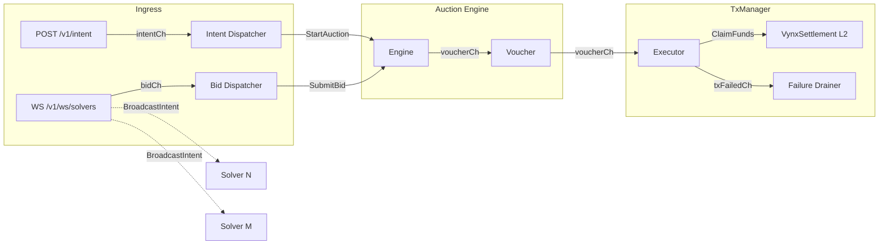
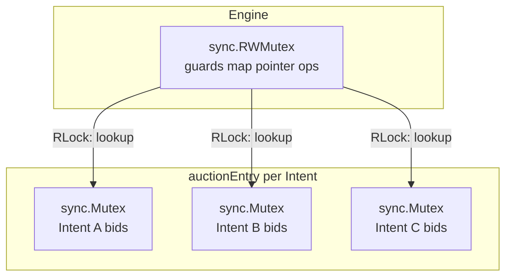
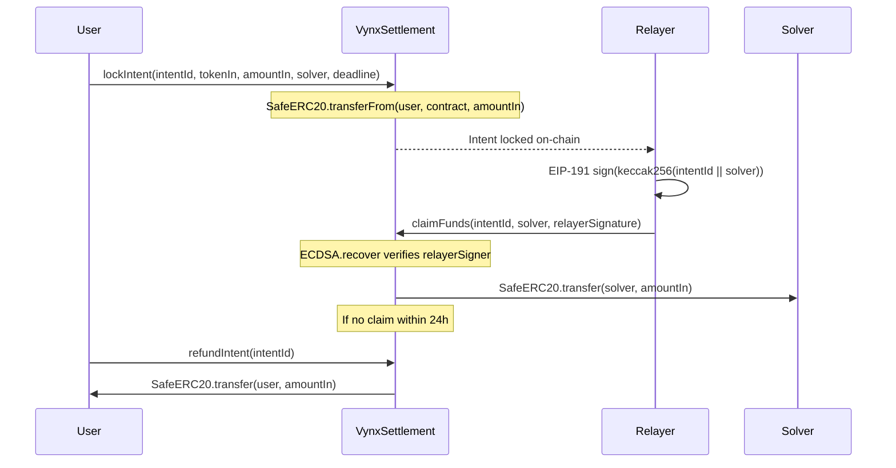

# VynX Relayer Architecture

## Overview

The VynX Relayer is a RAM-only, sub-200ms Order Flow Auction (OFA) engine for the Base L2 network (OP Stack). It receives user swap intents over HTTP, runs a configurable auction window to select the best solver bid, and submits the winning settlement transaction to the `VynxSettlement` escrow contract on-chain.

**Zero database. Zero disk I/O on the hot path. All state lives in process memory.**

---

## Event Bus Topology

All inter-package communication uses typed Go channels created in `cmd/relayer/main.go` and injected as constructor arguments. No package imports another domain package directly — the Go compiler enforces this boundary at build time.



### Channel Specifications

| Channel | Type | Buffer | Producer | Consumer |
|---------|------|--------|----------|----------|
| `intentCh` | `chan *core.Intent` | 256 | `ingress.Handler` | Intent Dispatcher |
| `bidCh` | `chan *core.Bid` | 10,000 | `ingress.Hub` | Bid Dispatcher |
| `voucherCh` | `chan *core.Voucher` | 256 | `auction.Engine` | `txmanager.Executor` |
| `txFailedCh` | `chan core.IntentID` | 128 | `txmanager.Executor` | Failure Drainer |

All channel sends use `select/default` (non-blocking). If a consumer is behind, messages are dropped and logged — never blocking the hot path.

---

## Concurrency Model

### Lock Sharding

The auction engine uses a two-level locking hierarchy to eliminate contention between independent intents:



**Locking hierarchy (always acquired in this order):**

1. `Engine.mu` (RWMutex) — to look up or register an entry pointer (microsecond hold time)
2. `auctionEntry.mu` (Mutex) — to append a bid or select a winner within that entry

The outer lock is **always released before** the inner lock is acquired. Concurrent bid submissions for different intents never contend on the same lock.

### Goroutine-per-Auction

Each `StartAuction` call spawns a dedicated goroutine that owns the full lifecycle:

1. Wait for `time.NewTimer(auctionTimeout)` to fire
2. `selectWinner()` — pick highest `AmountOut` (tie-break: highest `GasPrice`)
3. Emit `Voucher` to `voucherCh`
4. `Cleanup()` — `delete(map, key)` releases the entry

`time.NewTimer` is used instead of `time.After` to avoid goroutine leaks — the timer is explicitly stopped via `defer` on early exit.

### Atomic Nonce Queue

`NonceQueue` uses `sync/atomic.Uint64` for wait-free nonce assignment:

```go
func (q *NonceQueue) Next() uint64 {
    return q.current.Add(1) - 1  // O(1), lock-free
}
```

On nonce desync errors, `Resync()` performs a single `PendingNonceAt` RPC call and atomically overwrites the counter.

---

## Settlement Flow (Escrow Model)

The VynxSettlement contract operates as an escrow, not a direct swap:



### EIP-191 Signature (ECDSA V-Byte Normalization)

The relayer signs `keccak256(abi.encodePacked(intentId, solver))` using the EIP-191 prefix:

```
digest = keccak256("\x19Ethereum Signed Message:\n32" + keccak256(intentId || solver))
```

**Critical detail:** Go's `crypto.Sign` produces V in {0, 1}. OpenZeppelin ECDSA v5 (used by the contract) does **not** normalize V. The executor adds 27 before submitting:

```go
if sig[64] < 27 {
    sig[64] += 27
}
```

This normalization happens in `executor.go`, not in `KeyVault.Sign()`, because `KeyVault` is also used for transaction signing where V=0/1 is correct (go-ethereum's `WithSignature` handles that case internally).

---

## OP Stack Gas Model

Base L2 charges two independent fees per transaction:

| Fee Component | Source | Estimation Method |
|---------------|--------|-------------------|
| **L2 Execution Fee** | EVM gas x (baseFee + priorityFee) | `ethclient.EstimateGas` + 10% buffer |
| **L1 Data Fee** | Compressed calldata posted to L1 | `GasPriceOracle` precompile at `0x420...00F` |

Standard Ethereum tools that only call `EstimateGas` will systematically underestimate Base transaction costs. The `OPStackClient` wrapper queries both components pre-flight.

---

## Key Security Properties

| Property | Implementation |
|----------|---------------|
| Private key isolation | `KeyVault` stores only `*ecdsa.PrivateKey`; raw hex bytes zeroed via `clear(b)` immediately after `crypto.ToECDSA` |
| No key re-export | `KeyVault` exposes `Sign(digest)` and `Address()` only — no method returns the private key |
| Non-blocking hot path | Every channel send uses `select/default`; no goroutine can block the auction engine |
| Memory leak prevention | `Engine.Cleanup` calls `delete(map, key)` after every auction; Go GC reclaims at next cycle |
| Race detector mandate | All tests run with `go test -race`; any data race is a build-blocking defect |

---

## Package Dependency Graph

```
cmd/relayer/main.go
    |-- internal/core        (domain types: Intent, Bid, Voucher)
    |-- internal/signer      (KeyVault, ClaimDigest)
    |-- internal/auction     (Engine, lock sharding)
    |-- internal/ingress     (Handler, Hub, WebSocket)
    |-- internal/txmanager   (Executor, NonceQueue, OPStackClient)
    '-- bindings             (auto-generated VynxSettlement Go bindings)

internal/auction   --> internal/core
internal/ingress   --> internal/core
internal/txmanager --> internal/core, internal/signer
internal/signer    --> (no internal imports)
```

No circular imports. The Event Bus pattern enforces this at compile time.
